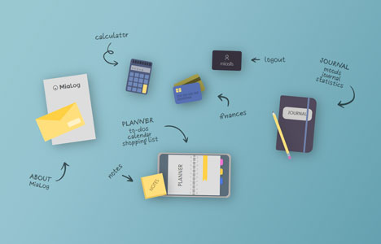

This page is in  English.
Para visualizar essa página em  Português, [clique aqui](./README-ptbr.md).

---

#  MiaLog

Imagens semelhantes a vetores, desenhadas com HTML e CSS como ícones para um aplicativo de produtividade.

Designs disponíveis:

- envelope e carta
- calculadora
- cartões de crédito
- cartão de visita
- diário e lápis
- planner e post-its

## 🔗 Demo

- [miaslls.github.io/MiaLog](http://miaslls.github.io/MiaLog/)

## 🖼️ Screenshots

## 👩‍💻 Autoria

- [@miaslls](https://www.github.com/miaslls)

## 🫶 Recursos / Agradecimentos

- [Freepik](https://freepik.com)
