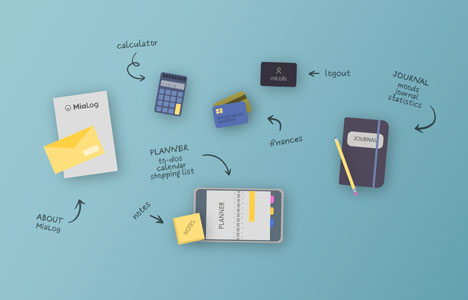

This page is in  English.
Para visualizar essa página em  Português, [clique aqui](./README-ptbr.md).

---

#  MiaLog

Vector-like images, designed with HTML and CSS as icons for a productivity app.

Designs available:

- envelope & letter
- calculator
- credit cards
- business card
- journal & pencil
- planner & post-its

## 🔗 Demo

- [mialog.camilasalles.dev](https://mialog.camilasalles.dev/)

## 🖼️ Screenshots

## 👩‍💻 Authors

- [@miaslls](https://www.github.com/miaslls)

## 🫶 Acknowledgements

- [Freepik](https://freepik.com)
